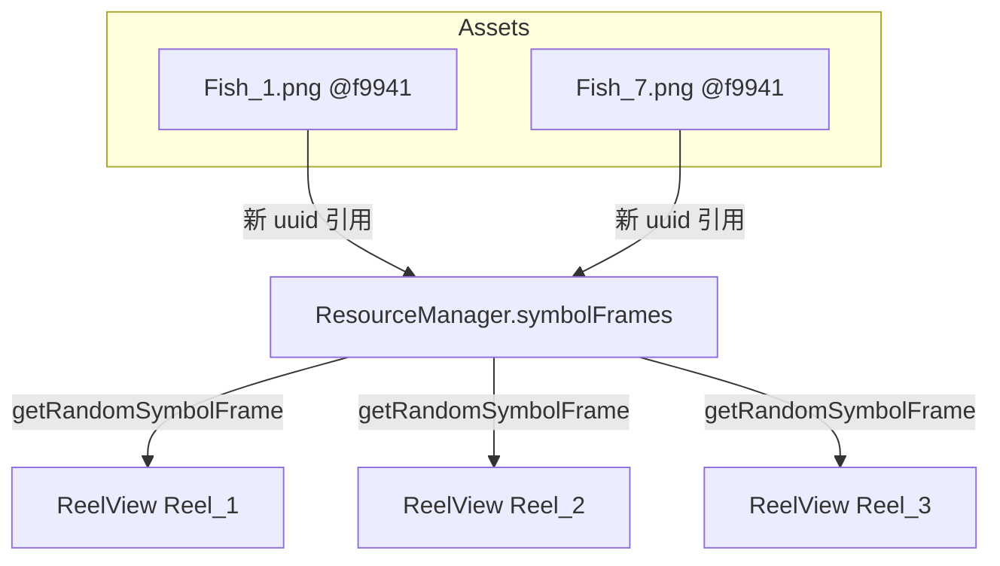

# Design Document

## Overview

本功能將場景 `main.scene` 中 `ResourceManager` 節點的 `symbolFrames` 陣列，由 7 張 debug 純色 SpriteFrame 替換為 Fish_1~Fish_7 的 SpriteFrame。這是**純資產引用資料的替換**：只更動場景檔中該陣列的 7 筆 `__uuid__`，不新增/修改任何 TypeScript 程式碼、不改元件結構。`ResourceManager` 作為集中式圖庫單例的角色、以及各 `ReelView` 向其抽圖的資料流皆維持不變。

## Steering Document Alignment

### Technical Standards (tech.md)
- **集中式設定管理**：沿用「Inspector 資產走 Component 型單例」決策 —— 圖庫仍集中於 `ResourceManager.symbolFrames` 單一真實來源，不回退為各 View 自掛。
- **SpriteFrame 子資產正確性**：依 tech.md「SpriteFrame 引用須用正確的 sprite-frame 子資產 uuid」，本設計使用 `@f9941`（sprite-frame importer）而非 `@6c48a`（texture importer）。
- **MCP 操作約束**：變更後須 `scene_save_scene` 持久化；如經磁碟直寫則須 `reimport_asset` 同步編輯器記憶體。

### Project Structure (structure.md)
- 不新增檔案，僅修改既有 `assets/scene/main.scene`。
- 遵循 structure.md 驗證流程：**磁碟序列化驗證 + Play 模式手動實跑**。
- Cocos 場景變更依專案規範經 `cocos-creator-developer` agent 執行，IDE 操作委由 `cocos-mcp-dev-assistant`。

## Code Reuse Analysis

本功能不撰寫新程式，完全複用既有元件；「複用」體現在無需改動任何一行邏輯。

### Existing Components to Leverage
- **`ResourceManager`（`assets/scripts/singleton/ResourceManager.ts`）**：既有集中式圖庫單例。其 `@property( { type: [ SpriteFrame ] } ) symbolFrames` 直接承接新的 7 筆 Fish SpriteFrame，`getSymbolFrames()` / `getRandomSymbolFrame()` 無需改動。
- **`ReelView`（`assets/scripts/view/ReelView.ts`）**：既有向 `ResourceManager` 抽圖的消費端，透明受惠於圖庫內容更新，零改動。
- **Fish_1~7 資產（`assets/textures/Fish_*.png`）**：已存在且 `.meta` 皆含有效 `@f9941` sprite-frame 子資產，直接引用。

### Integration Points
- **場景檔 `assets/scene/main.scene`**：唯一整合點 —— `ResourceManager` 節點元件的 `symbolFrames` 陣列（現位於檔案第 5288–5317 行附近）。
- **資產資料庫（Asset DB）**：新 uuid 引用須能被 Asset DB 解析為有效 SpriteFrame（透過 reimport/重載驗證）。

## Architecture

單一資料替換，資料流結構不變：



替換前後唯一差異：`RM` 的 7 個來源由 `debug/color_*@f9941` 改為 `Fish_1~7@f9941`。

## Components and Interfaces

### ResourceManager 節點（場景元件實例）
- **Purpose:** 持有集中式符號圖庫；本功能更新其 `symbolFrames` 內容。
- **Interfaces:** 對外 API `getSymbolFrames(): SpriteFrame[]`、`getRandomSymbolFrame(): SpriteFrame | null` —— **簽章與行為皆不變**。
- **Dependencies:** Fish_1~7 的 SpriteFrame 子資產。
- **Reuses:** 完整複用 `ResourceManager.ts` 現有實作，無程式變更。

## Data Models

### symbolFrames 陣列（場景序列化）
替換後 7 筆項目，依序如下（`__expectedType__` 皆為 `cc.SpriteFrame`）：

```
symbolFrames: [
  01dff65a-e3e2-401d-ade2-0a5eb5607893@f9941  # Fish_1
  07a05d57-0181-4f42-9723-2424464f500a@f9941  # Fish_2
  25ca2f9c-c7fe-4f54-9256-cdb0ae91c951@f9941  # Fish_3
  7446020f-1713-4ff2-9544-8126e6ed4bb4@f9941  # Fish_4
  44847cbd-eff4-4f88-9972-f3db2974411d@f9941  # Fish_5
  8b81402c-7104-4a2d-b3a8-f3654b00d87e@f9941  # Fish_6
  fc59e954-514a-47ed-85e8-865db7bbbcbf@f9941  # Fish_7
]
```

> **關鍵**：子資產後綴為 `@f9941`（sprite-frame importer），**非** `@6c48a`（texture importer）。已核對全部 7 份 `.meta` 確認 `@f9941` 存在且 type=sprite-frame。

## Error Handling

### Error Scenarios
1. **誤用 texture 子資產（`@6c48a`）：**
   - **Handling:** 設計明定使用 `@f9941`；替換後以磁碟序列化比對後綴確認。
   - **User Impact:** 若誤用，Sprite 顯示異常或引用被 revert；本設計已規避。

2. **uuid 拼寫錯誤 / 少一筆：**
   - **Handling:** 完成後讀回 `symbolFrames` 驗證恰好 7 筆且順序、uuid 與設計表一致。
   - **User Impact:** 圖庫缺圖或抽到錯圖；由驗證步驟攔截。

3. **編輯器記憶體未同步（磁碟直寫時）：**
   - **Handling:** 依 tech.md，磁碟直寫後 `reimport_asset`/重載場景。
   - **User Impact:** 場景查詢仍顯示舊圖；reimport 後消除。

4. **Fish `.meta` 缺 sprite-frame 子資產：**
   - **Handling:** 已於設計前核對，7 份皆含有效 `@f9941`，無需修復（需求 3.2 條件不觸發）。
   - **User Impact:** 無。

## Testing Strategy

### Unit Testing
- 無單元測試（純資產資料替換，無新增邏輯；專案現階段亦無自動化測試流程，見 structure.md）。

### Integration Testing
- **磁碟序列化驗證**：儲存場景後讀回 `main.scene`，確認 `symbolFrames` 恰 7 筆、後綴皆 `@f9941`、uuid 與順序符合 Data Models 表、且不含任何 `debug/color_*` 引用。

### End-to-End Testing
- **Play 模式手動實跑**（由使用者執行）：於 Cocos 編輯器點播放，確認三輪轉輪顯示 Fish 魚類圖案、無 missing/invalid 警告、`getRandomSymbolFrame()` 正常抽圖、轉輪與停輪行為一如往常。
- 注意：不經 MCP 啟動外部 preview（memory `mcp-cannot-start-external-preview`），須請使用者手動點播放。
